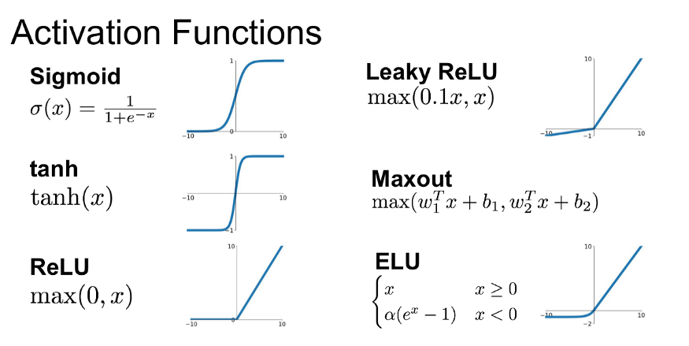
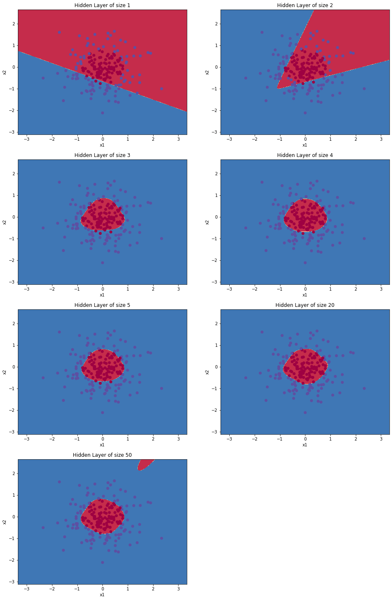
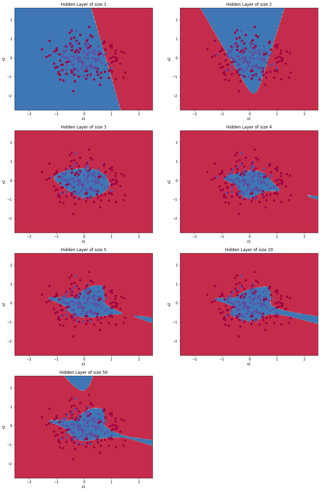
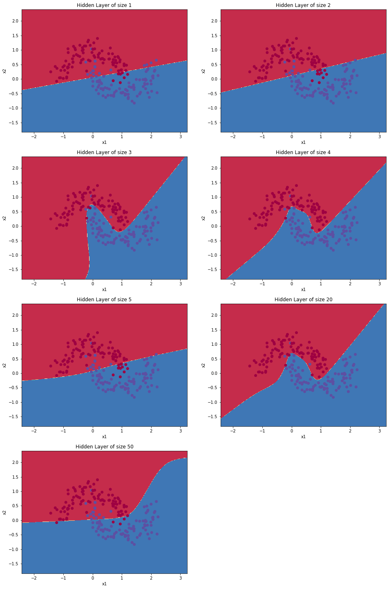
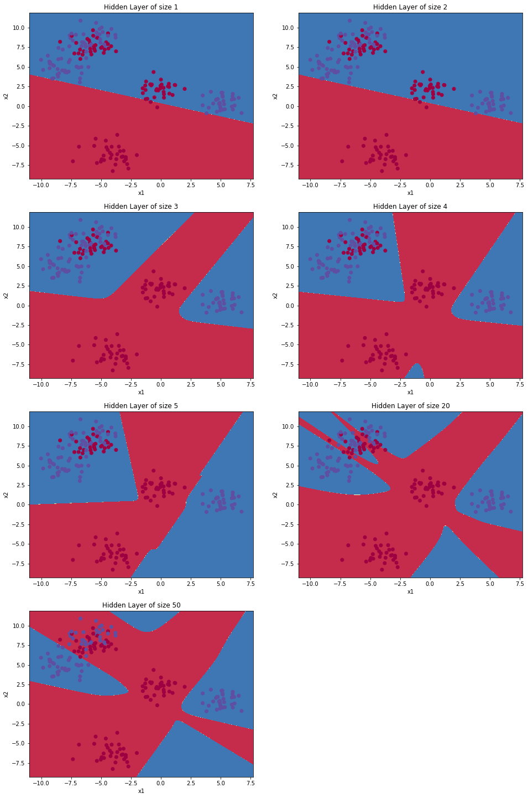
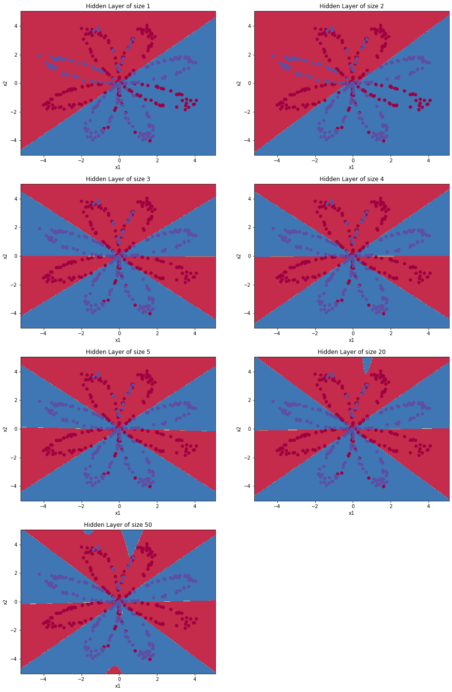

# **Single Layer Neural Network**
Hello world. I did coursera's [Deep Learning Specialization](https://www.coursera.org/specializations/deep-learning?). I am implementing the different algorithms and concepts I learnt in the course, using C++. So, in this series I'm starting with the implementation of a single layer neural network on planar data. You can contact me over [LinkedIn](https://www.linkedin.com/in/gopiraj15/)

### **Dependencies:**
```
OpenCV 3+
```

### **Neural Network Model:**


**Mathematically**:

For one example }):

![z^{[1] (i)} =  W^{[1]} x^{(i)} + b^{[1]}\tag{1}](https://latex.codecogs.com/png.latex?z^{[1]&space;(i)}&space;=&space;W^{[1]}&space;x^{(i)}&space;&plus;&space;b^{[1]})

![a^{[1] (i)} = \tanh(z^{[1] (i)})\tag{2}](https://latex.codecogs.com/png.latex?a%5E%7B%5B1%5D%20%28i%29%7D%20%3D%20%5Ctanh%28z%5E%7B%5B1%5D%20%28i%29%7D%29)

![z^{[2] (i)} = W^{[2]} a^{[1] (i)} + b^{[2]}\tag{3}](https://latex.codecogs.com/png.latex?z%5E%7B%5B2%5D%20%28i%29%7D%20%3D%20W%5E%7B%5B2%5D%7D%20a%5E%7B%5B1%5D%20%28i%29%7D%20&plus;%20b%5E%7B%5B2%5D%7D)


![\hat{y}^{(i)} = a^{[2] (i)} = \sigma(z^{ [2] (i)})\tag{4}](https://latex.codecogs.com/png.latex?%5Chat%7By%7D%5E%7B%28i%29%7D%20%3D%20a%5E%7B%5B2%5D%20%28i%29%7D%20%3D%20%5Csigma%28z%5E%7B%20%5B2%5D%20%28i%29%7D%29)


} > 0.5 \\ 0 & \mbox{otherwise } \end{cases}\tag{5}](https://latex.codecogs.com/png.latex?y%5E%7B%28i%29%7D_%7Bprediction%7D%20%3D%20%5Cbegin%7Bcases%7D%201%20%26%20%5Cmbox%7Bif%20%7D%20a%5E%7B%5B2%5D%28i%29%7D%20%3E%200.5%20%5C%5C%200%20%26%20%5Cmbox%7Botherwise%20%7D%20%5Cend%7Bcases%7D)


Given the predictions on all the examples, you can also compute the cost J as follows: 

![J = - \frac{1}{m} \sum\limits_{i = 0}^{m} \large\left(\small y^{(i)}\log\left(a^{[2] (i)}\right) + (1-y^{(i)})\log\left(1- a^{[2] (i)}\right)  \large  \right) \small \tag{6}](https://latex.codecogs.com/png.latex?J%20%3D%20-%20%5Cfrac%7B1%7D%7Bm%7D%20%5Csum%5Climits_%7Bi%20%3D%200%7D%5E%7Bm%7D%20%5Clarge%5Cleft%28%5Csmall%20y%5E%7B%28i%29%7D%5Clog%5Cleft%28a%5E%7B%5B2%5D%20%28i%29%7D%5Cright%29%20&plus;%20%281-y%5E%7B%28i%29%7D%29%5Clog%5Cleft%281-%20a%5E%7B%5B2%5D%20%28i%29%7D%5Cright%29%20%5Clarge%20%5Cright%29%20%5Csmall)

We will do the following things in the code
	1. Initialize the weights and biases
	2. Implement forward propagation
	3. Compute the cost
	4. Compute the gradients using backpropagation
	5. Update the weights using gradient descent
	6. Predict and calculate accuracy

### **Math functions:**
Activation function: An activation function activates a neuron, i.e., it determines whether a neuron should output some values to the next layer. 



obtained from [medium](https://medium.com/@shrutijadon10104776/survey-on-activation-functions-for-deep-learning-9689331ba092)

We implement tanh and sigmoid activation functions as follows

```c++
cv::Mat tanh(cv::Mat ip)
{
	cv::Mat p_exp, n_exp;
	cv::exp(ip, p_exp);
	cv::exp(-ip, n_exp);
	return (p_exp - n_exp) / (p_exp + n_exp);
}
```

```c++
cv::Mat sigmoid(cv::Mat ip)
{
	cv::Mat n_exp;
	cv::exp(-ip, n_exp);
	return cv::Mat(1 / (1 + n_exp));
}
```

### **Parameter Initialization**
We initialize the weight matrices with random values and the biases with zeros. We should not initialize the weights as zeros or any constant value, since after every iteration of forward propagation, we won't be learning anything. 

As given in the previous section, forward propagation equations are implemented.

### **Backpropagation**
Backpropagation is one of the important steps in training a neural network. During this step, we calculate the gradients, using which we update the weights with gradient descent algorithm. This is done for multiple iterations till the cost is minimized or the number of iterations is reached.


referred from Andrew Ng lecture

### **Gradient Descent**
Gradient descent is an optimization algorithm used to find the values of coefficients of a function (f) that minimizes a cost function. The idea is to take repeated steps in the opposite direction of the gradient (or approximate gradient) of the function at the current point, because this is the direction of steepest descent

**General gradient descent rule**:
$ \theta = \theta - \alpha \frac{\partial J }{ \partial \theta }$ where $\alpha$ is the learning rate and $\theta$ represents a parameter.

**Illustration**: The gradient descent algorithm with a good learning rate (converging) and a bad learning rate (diverging). Images courtesy of Adam Harley.


### **Results**
Lets see how our model performs on different planar data. It can be seen that, when we increase the size of the hidden layer, we are able to learn complex model. We can also see that, very large model overfit the data.
NOTE: we are visualizing the output of various size of the hidden layer. The data is include in the `data` folder

**Gaussian Quantiles:**


**Noisy Circles:**


**Noisy Moons:**


**Blobs:**


**Planar Data:**

